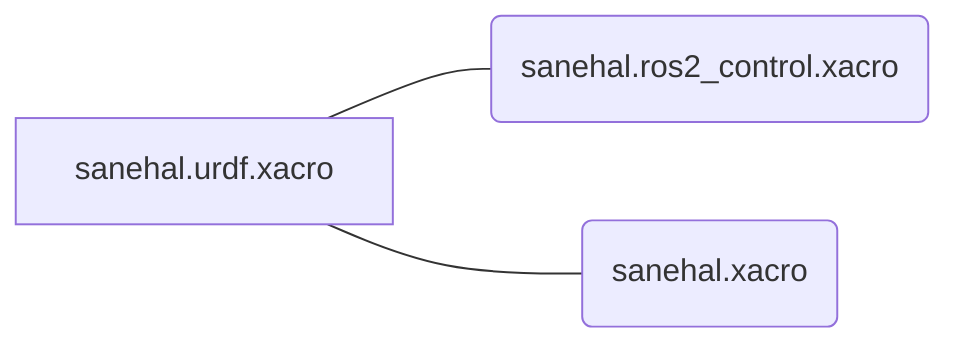

# sanehal_vehicle_description

## SANEHAL-2 JT16 frame

JT16のframeは `sanehal_base_link` からfixed joint `jt16_joint` で接続する
`hesai_lidar` です。Issue #30ではHesai driverの `ros.ros_frame_id` を
同じ値にしてください。TFは `robot_state_publisher` が配信するため、driverの
launchから同じstatic TFを重複配信しないでください。

走行中のTF所有者は、`sanehal_base_controller`が
`odom -> base_footprint`、`robot_state_publisher`が
`base_footprint -> base_link -> sanehal_base_link -> hesai_lidar`です。
`slam_toolbox`だけが`map -> odom`を配信します。

SANEHAL-2で実測した取付TFは `xyz="-0.080 0 0.250"` [m]、`rpy="0 0 0"`
[rad] です。`hesai_lidar` の物理基準はJT16底面中心で、コネクタ面は機体後方を向きます。

visual/collisionは実測外形 `0.075 x 0.075 x 0.064` [m] の簡略boxです。
link原点が底面中心のため、box中心はz方向へ `0.032` [m] offsetしています。

このパッケージは[ros2_control_demos](https://github.com/ros-controls/ros2_control_demos)のdiffbotを改変して作成されました。

## 概要
台車部分コントロール用のパッケージ

ビルドにはROBOTIS公式のDynamixelSDK、dynamixel_hardware_interface、
dynamixel_interfacesが必要です。`build_depends.repos`から取得できます。
ros2_controlを使用して実装します。

左車輪はDynamixel ID 2、右車輪はID 1、baud rate 1 Mbps、velocity modeで構成します。
実機のmodelは起動時にmodel numberから自動検出されます。モータ取付方向の反転は
controllerの車輪半径ではなくros2_controlのtransmission matrixで扱います。

## 駆動系寸法とodometry

SANEHAL-2のrobot descriptionに記録されている公称値は次の通りです。

- 車輪半径: 0.0395 m
- 左右車輪中心のY座標: +0.100 m / -0.100 m
- 左右車輪中心間距離: 0.200 m

`controllers/sanehal_controllers.yaml` はこの公称値を初期値として使用します。
ただし、タイヤの変形や荷重、床面、組立誤差のため、公称CAD寸法とodometryに
適した実効車輪半径・実効トレッドは一致しない場合があります。実機の車輪外周と
左右駆動輪の接地点間距離を測定し、直進距離とその場旋回角によるcalibrationは
Issue #25で行ってください。calibration前のmultiplierはすべて1.0です。

Issue #25の実機試験は
[`doc/sanehal2_drive_hardware_validation.md`](doc/sanehal2_drive_hardware_validation.md)
の安全確認・24項目の順序に従ってください。

OdometryはDynamixelの車輪位置feedbackを使用します（`open_loop: false`）。
モータの取付方向反転はhardware transmissionで吸収されるため、車輪半径の
multiplierを符号反転に使用してはいけません。

## 実行方法

表示テスト

```bash
ros2 launch sanehal_bringup sanehal_on_pi.launch.py
```


```
ros2 control list_controllers
```

```
timeout 2 ros2 topic pub --rate 10 /sanehal_base_controller/cmd_vel geometry_msgs/msg/TwistStamped \
  "{twist: {linear: {x: 0.05}, angular: {z: 0.0}}}"
```


## run only

```
ros2 topic pub --once /sanehal_base_controller/cmd_vel geometry_msgs/msg/TwistStamped \
  "{twist: {linear: {x: 0.0}, angular: {z: 0.0}}}"

```


## 構造


